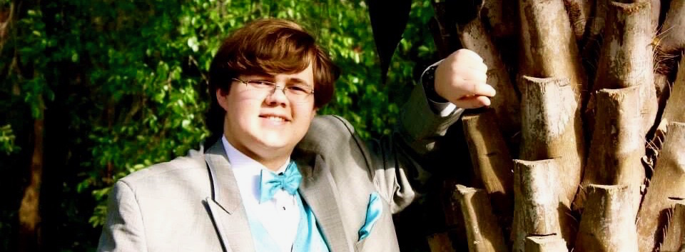

---
# Feel free to add content and custom Front Matter to this file.
# To modify the layout, see https://jekyllrb.com/docs/themes/#overriding-theme-defaults

layout: home
---

# Welcome!
I am Tristen Allen, a fourth-year Computer Sciences major at the Georgia Institute of Technology, with a concentration in Systems and Architecture and Theory. I am currently the [Technique](http://nique.net)'s Web Developer, a member of the Georgia Tech [Student Government Association](sga.gatech.edu)'s IT Board, and a TA for the College of Computing's introductory computer organization course, CS 2200.

I am also a musician, having played the trombone in marching, concert, and jazz bands for over a decade. I am currently a member of the Georgia Tech Yellow Jacket Marching Band and play the bass trombone in Tech's primary jazz ensemble. During my time at the Technique, I have also had the opportunity to write a number of news and opinion pieces, which you can find [here](http://nique.net/author/tristen-allen/).